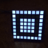

# espruino-adafruit-led-backpack

This is an driver that closely mirrors the [Adafruit's LED Backpack Library](https://github.com/adafruit/Adafruit-LED-Backpack-Library).

This package currently works with Adafruit 8x8 Single Color LED Backpacks.

* 0.8" ([872](https://www.adafruit.com/products/872), [871](https://www.adafruit.com/products/871), [870](https://www.adafruit.com/products/870) )
* 1.2" ([1049](https://www.adafruit.com/products/1049), [1052](https://www.adafruit.com/products/1052), [1051](https://www.adafruit.com/products/1051), [1050](https://www.adafruit.com/products/1050), [1614](https://www.adafruit.com/products/1614), [1632](https://www.adafruit.com/products/1632), [1857](https://www.adafruit.com/products/1857), [1854](https://www.adafruit.com/products/1854), [1855](https://www.adafruit.com/products/1855), [1856](https://www.adafruit.com/products/1856))

This library was tested on on the [Small 1.2" 8x8 Ultra Bright Square White LED Matrix + Backpack, PRODUCT ID: 1857](https://www.adafruit.com/products/1857).

This **doesn't** work with the 7-Segment backpacks or 8x16 backpacks.

## Example Code for 8 x 8 Matrix

To use this library in the Espruino Web IDE you need to go to `Settings > Communications > Check 'Load modules from NPM (BETA)'`.

Here's some example code that mirrors the Adafruit's example code for [the 8x8 Matrix example code for Arduino](https://github.com/adafruit/Adafruit-LED-Backpack-Library/blob/master/examples/matrix8x8/matrix8x8.ino).

```javascript
var Matrix8x8 = require("espruino-adafruit-led-backpack").Matrix8x8;

//Clock: B6 Data: B7 Device Address: 0x70, Brightness: 0-15
var matrix = new Matrix8x8({scl:B6, sda:B7, address:0x70, brightness: 0});

//Squint a little and you can see the faces!

// :)
var smileBmp = [
    0b00111100,
    0b01000010,
    0b10100101,
    0b10000001,
    0b10100101,
    0b10011001,
    0b01000010,
    0b00111100
],
//:|
    neutralBmp = [
    0b00111100,
    0b01000010,
    0b10100101,
    0b10000001,
    0b10111101,
    0b10000001,
    0b01000010,
    0b00111100
],
//:(
  frownBmp = [
    0b00111100,
    0b01000010,
    0b10100101,
    0b10000001,
    0b10011001,
    0b10100101,
    0b01000010,
    0b00111100
];

//Hacky scynchronous timeout :)
function delay(time) {
  var i = 0;
  while(i < time * 10) {  i++; }
}

//Draws Smiley Face
matrix.clear();
matrix.drawBitmap(smileBmp);
matrix.writeDisplay();
delay(500);

//Draws Neutral Face
matrix.clear();
matrix.drawBitmap(neutralBmp);
matrix.writeDisplay();
delay(500);

//Draws Frowny Face
matrix.clear();
matrix.drawBitmap(frownBmp);
matrix.writeDisplay();
delay(500);

//Draws a pixel at the top left x = 0, y = 0
matrix.clear();
matrix.drawPixel(0, 0);
matrix.writeDisplay();
delay(500);

//Draws a diagonal line between x1 = 0, y1 = 0 and x2 = 7, y2 = 7
matrix.clear();
matrix.drawLine(0,0, 7,7);
matrix.writeDisplay();
delay(500);

//Draws a rectangle at x = 0, y = 0 and a witdth = 8 and height = 8
matrix.clear();
matrix.drawRect(0,0, 8,8);
matrix.writeDisplay();
delay(500);

//Draws the same rectangle as abover with a filled in rectangle 4 by 4 starting at x = 2, y = 2
matrix.clear();
matrix.drawRect(0,0, 8,8);
matrix.fillRect(2,2, 4,4);
matrix.writeDisplay();
delay(500);
```

Here's a gif of the above code in action:




## Todos - A.K.A. Please Help
- [ ] Finish Parity for 8 x 8 Display
  - [ ] `drawCircle()`
  - [ ] `setTextWrap()`
  - [ ] `setTextColor()`
  - [ ] `setCursor()`
  - [ ] `print()`
  - [ ] `setRotation()`
- [ ] Implement 7 Segment Display
- [ ] Implement 8 x 16 LED Display
