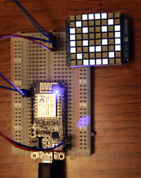
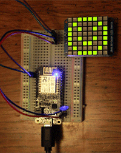
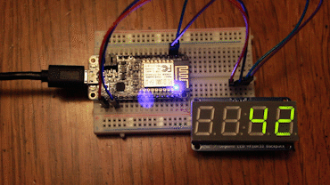
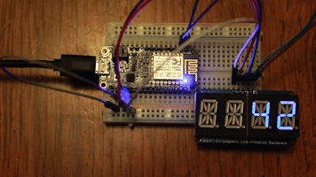
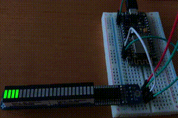

# @thingssdk/ht16k33 for JavaScript

[](https://travis-ci.org/thingsSDK/ht16k33) 
[](https://codecov.io/gh/thingsSDK/ht16k33)
[](https://david-dm.org/thingsSDK/ht16k33)
[](https://david-dm.org/thingsSDK/ht16k33#info=devDependencies)

A modern JavaScript driver for the LED matrix backpacks with the HT16K33 controller chip. The driver works with any Adafruit 8x8 monochrome, 8x8 bicolor and 16x8 monochrome LED backpacks.

* 8x8 0.8" ([872](https://www.adafruit.com/products/872), [871](https://www.adafruit.com/products/871), [870](https://www.adafruit.com/products/870))
* 8x8 1.2" ([1049](https://www.adafruit.com/products/1049), [1052](https://www.adafruit.com/products/1052), [1051](https://www.adafruit.com/products/1051), [1050](https://www.adafruit.com/products/1050), [1614](https://www.adafruit.com/products/1614), [1632](https://www.adafruit.com/products/1632), [1857](https://www.adafruit.com/products/1857), [1854](https://www.adafruit.com/products/1854), [1855](https://www.adafruit.com/products/1855), [1856](https://www.adafruit.com/products/1856))
* 16x8 1.2" ([2044](https://www.adafruit.com/products/2044), [2038](https://www.adafruit.com/products/2038), [2037](https://www.adafruit.com/products/2037), [2040](https://www.adafruit.com/products/2040), [2041](https://www.adafruit.com/products/2041), [2039](https://www.adafruit.com/products/2039), [2043](https://www.adafruit.com/products/2043), [2042](https://www.adafruit.com/products/2042), [2035](https://www.adafruit.com/products/2035), [2036](https://www.adafruit.com/products/2036), [2052](https://www.adafruit.com/products/2052), [2054](https://www.adafruit.com/products/2054))
* 16x8 LED Matrix Driver Backpack ([1427](https://www.adafruit.com/products/1427))

This module works with the 7-Segment backpacks and 14-segment alphanumeric backpacks.

* 7 segment display ([878](https://www.adafruit.com/products/878), [879](https://www.adafruit.com/products/879), [880](https://www.adafruit.com/products/880), [881](https://www.adafruit.com/products/881)), 
* 14 segment alphanumeric display ([1911](https://www.adafruit.com/products/1911), [1912](https://www.adafruit.com/products/1912), [2157](https://www.adafruit.com/products/2157), [2158](https://www.adafruit.com/products/2158), [2159](https://www.adafruit.com/products/2159), [2160](https://www.adafruit.com/products/2160)), 

This is also compatible with the Adafruit Feather wings too.

* Adafruit 0.8" 8x16 LED Matrix FeatherWing Display ([3150](https://www.adafruit.com/products/3150), [3151](https://www.adafruit.com/products/3151), [3152](https://www.adafruit.com/products/3152), [3153](https://www.adafruit.com/products/3153), [3154](https://www.adafruit.com/products/3154))
* Adafruit 0.56" 4-Digit 7-Segment FeatherWing Display ([3106](https://www.adafruit.com/products/3106), [3107](https://www.adafruit.com/products/3107), [3108](https://www.adafruit.com/products/3108), [3109](https://www.adafruit.com/products/3109), [3110](https://www.adafruit.com/products/3110))
* Adafruit 0.54" Quad Alphanumeric (14 segment) FeatherWing Display ([3127](https://www.adafruit.com/products/3127), [3128](https://www.adafruit.com/products/3128), [3129](https://www.adafruit.com/products/3129), [3130](https://www.adafruit.com/products/3130), [3131](https://www.adafruit.com/products/3131), [3132](https://www.adafruit.com/products/3132))

## Runtime Compatibility

Works with the thingsSDK-based projects running on the Espruino runtime. More to come.

## Example Code for 8 x 8 Matrix



```javascript

import { connect8x8Matrix } from '@thingssdk/ht16k33/espruino';

//Squint a little and you can see the faces!

// :)
const smileBmp = [
    0b00111100,
    0b01000010,
    0b10100101,
    0b10000001,
    0b10100101,
    0b10011001,
    0b01000010,
    0b00111100
];
//:|
const neutralBmp = [
    0b00111100,
    0b01000010,
    0b10100101,
    0b10000001,
    0b10111101,
    0b10000001,
    0b01000010,
    0b00111100
];
//:(
const frownBmp = [
    0b00111100,
    0b01000010,
    0b10100101,
    0b10000001,
    0b10011001,
    0b10100101,
    0b01000010,
    0b00111100
];

//Run Example Code
function main() {
    const matrix = connect8x8Matrix();

    //Draws Smiley Face
    matrix.render(smileBmp);

    //Draws Neutral Face after 1 second
    setTimeout(() => {
        matrix.render(neutralBmp);
    }, 1000);

    //Draws Frowny Face after 2 seconds
    setTimeout(() => {
        matrix.render(frownBmp);
    }, 2000);
}
```

## Example Code for 16 x 8 Matrix


```javascript

import { connect16x8Matrix } from '@thingssdk/ht16k33/espruino';

// Draw smile and frown side by side
const smileFrownBmp = [
    0b00111100, 0b00111100,
    0b01000010, 0b01000010,
    0b10100101, 0b10100101,
    0b10000001, 0b10000001,
    0b10100101, 0b10011001,
    0b10011001, 0b10100101,
    0b01000010, 0b01000010,
    0b00111100, 0b00111100
];
// Draw smile and mehside by side
const smileMehBmp = [
    0b00111100, 0b00111100,
    0b01000010, 0b01000010,
    0b10100101, 0b10100101,
    0b10000001, 0b10000001,
    0b10100101, 0b10000001,
    0b10011001, 0b10111101,
    0b01000010, 0b01000010,
    0b00111100, 0b00111100
];

//Run Example Code
function main() {
    const matrix = connect16x8Matrix()

    //Render bitmap of smily face and frown
    matrix.render(smileFrownBmp);

    //Render bitmap of smily face and meh face 
    setTimeout(() => matrix.render(smileMehBmp), 1000);
}
```


## Example Code for 8 x 8 Bi-Color Matrix



```javascript

import { connect8x8BicolorMatrix } from '@thingssdk/ht16k33/espruino';

//Squint a little and you can see the faces!

// :) - Green
const smileBmp = [
    0b00111100, 0b00000000,
    0b01000010, 0b00000000,
    0b10100101, 0b00000000,
    0b10000001, 0b00000000,
    0b10100101, 0b00000000,
    0b10011001, 0b00000000,
    0b01000010, 0b00000000,
    0b00111100, 0b00000000
];
//:| - Orange
const neutralBmp = [
    0b00111100, 0b00111100,
    0b01000010, 0b01000010,
    0b10100101, 0b10100101,
    0b10000001, 0b10000001,
    0b10111101, 0b10111101,
    0b10000001, 0b10000001,
    0b01000010, 0b01000010,
    0b00111100, 0b00111100
];
//:( - Red
const frownBmp = [
    0b00000000, 0b00111100,
    0b00000000, 0b01000010,
    0b00000000, 0b10100101,
    0b00000000, 0b10000001,
    0b00000000, 0b10011001,
    0b00000000, 0b10100101,
    0b00000000, 0b01000010,
    0b00000000, 0b00111100
];
// :) - Multicolor Face
const multiSmileBmp = [
    0b00111100, 0b00000000,
    0b01000010, 0b00000000,
    0b10100101, 0b00100100,
    0b10000001, 0b00000000,
    0b10000001, 0b00100100,
    0b10000001, 0b00011000,
    0b01000010, 0b00000000,
    0b00111100, 0b00000000
];

//Run Example Code
function main() {
    const matrix = connect8x8BicolorMatrix();

    //Draws Smiley Face
    matrix.render(smileBmp);

    //Draws Neutral Face after 1 second
    setTimeout(() => {
        matrix.render(neutralBmp);
    }, 1000);

    //Draws Frowny Face after 2 seconds
    setTimeout(() => {
        matrix.render(frownBmp);
    }, 2000);

    //Draws Multicolor Face after 3 seconds
    setTimeout(() => {
        matrix.render(multiSmileBmp);
    }, 3000);
}
```

## Example Code for 7 Segment Display



```javascript

import { connect7SegmentDisplay } from '@thingssdk/ht16k33/espruino';

//Run Example Code
function main() {
    const matrix = connect7SegmentDisplay();

    //You can render numbers
    matrix.render(42);

    //Negative numbers
    setTimeout(() => {
        matrix.render(-999);
    }, 1000);

    //Times and strings
    setTimeout(() => {
        matrix.render("04:20");
    }, 2000);

    //Numbers with decimal places
    setTimeout(() => {
        matrix.render(3.141);
    }, 3000);

    //Or strings with multiple dots
    setTimeout(() => {
        matrix.render("1.2.3.4.");
    }, 4000);

    //Even, just dashes
    setTimeout(() => {
        matrix.render("----");
    }, 5000);

    //Spaces are valid too
    setTimeout(() => {
        matrix.render("0  -");
    }, 6000);
}
```

## Example Code for 14 Segment Display



```javascript
import { connect14SegmentDisplay } from '@thingssdk/ht16k33/espruino';

//Run Example Code
function main() {
    const matrix = connect14SegmentDisplay();

    //You can render numbers
    matrix.render(42);

    //Negative numbers
    setTimeout(() => {
        matrix.render(-999);
    }, 1000);

    //Letters and symbols
    setTimeout(() => {
        matrix.render("HI@U");
    }, 2000);

    //Numbers with decimal places
    setTimeout(() => {
        matrix.render(3.141);
    }, 3000);

    //Or strings with multiple dots
    setTimeout(() => {
        matrix.render("1.2.3.4.");
    }, 4000);

    //Uppercase letters
    setTimeout(() => {
        matrix.render("UPPR");
    }, 5000);

    //And lowercase
    setTimeout(() => {
        matrix.render("lowr");
    }, 6000);
}
```

## Example Code for 24 Segment Bargrah




```
import { connect8x8BicolorMatrix } from '@thingssdk/ht16k33/espruino';
var intervalId =0;
//Squint a little and you can see the faces!

const patterns = [
    // Grow green 1/2
    [[0b00000000, 0b00000011], [0b00000000, 0b00000000], [0b00000000, 0b00000000]],
    [[0b00000000, 0b00001111], [0b00000000, 0b00000000], [0b00000000, 0b00000000]],
    [[0b00000000, 0b00001111], [0b00000000, 0b00000011], [0b00000000, 0b00000000]],
    [[0b00000000, 0b00001111], [0b00000000, 0b00001111], [0b00000000, 0b00000000]],
    [[0b00000000, 0b00001111], [0b00000000, 0b00001111], [0b00000000, 0b00000011]],
    [[0b00000000, 0b00001111], [0b00000000, 0b00001111], [0b00000000, 0b00001111]],

    // Grow green 2/2
    [[0b00000000, 0b00111111], [0b00000000, 0b00001111], [0b00000000, 0b00001111]],
    [[0b00000000, 0b11111111], [0b00000000, 0b00001111], [0b00000000, 0b00001111]],
    [[0b00000000, 0b11111111], [0b00000000, 0b00111111], [0b00000000, 0b00001111]],
    [[0b00000000, 0b11111111], [0b00000000, 0b11111111], [0b00000000, 0b00001111]],
    [[0b00000000, 0b11111111], [0b00000000, 0b11111111], [0b00000000, 0b00111111]],
    [[0b00000000, 0b11111111], [0b00000000, 0b11111111], [0b00000000, 0b11111111]],

    // Grow Yellow 1/2
    [[0b00000011, 0b00000011], [0b00000000, 0b00000000], [0b00000000, 0b00000000]],
    [[0b00001111, 0b00001111], [0b00000000, 0b00000000], [0b00000000, 0b00000000]],
    [[0b00001111, 0b00001111], [0b00000011, 0b00000011], [0b00000000, 0b00000000]],
    [[0b00001111, 0b00001111], [0b00001111, 0b00001111], [0b00000000, 0b00000000]],
    [[0b00001111, 0b00001111], [0b00001111, 0b00001111], [0b00000011, 0b00000011]],
    [[0b00001111, 0b00001111], [0b00001111, 0b00001111], [0b00001111, 0b00001111]],

    // Grow Yellow 2/2
    [[0b00111111, 0b00111111], [0b00001111, 0b00001111], [0b00001111, 0b00001111]],
    [[0b11111111, 0b11111111], [0b00001111, 0b00001111], [0b00001111, 0b00001111]],
    [[0b11111111, 0b11111111], [0b00111111, 0b00111111], [0b00001111, 0b00001111]],
    [[0b11111111, 0b11111111], [0b11111111, 0b11111111], [0b00001111, 0b00001111]],
    [[0b11111111, 0b11111111], [0b11111111, 0b11111111], [0b00111111, 0b00111111]],
    [[0b11111111, 0b11111111], [0b11111111, 0b11111111], [0b11111111, 0b11111111]],

    // Grow red 1/2
    [[0b00000000, 0b00000000], [0b00000000, 0b00000000], [0b00000000, 0b00000000]],
    [[0b00000011, 0b00000000], [0b00000000, 0b00000000], [0b00000000, 0b00000000]],
    [[0b00001111, 0b00000000], [0b00000000, 0b00000000], [0b00000000, 0b00000000]],
    [[0b00001111, 0b00000000], [0b00000011, 0b00000000], [0b00000000, 0b00000000]],
    [[0b00001111, 0b00000000], [0b00001111, 0b00000000], [0b00000000, 0b00000000]],
    [[0b00001111, 0b00000000], [0b00001111, 0b00000000], [0b00000011, 0b00000000]],
    [[0b00001111, 0b00000000], [0b00001111, 0b00000000], [0b00001111, 0b00000000]],

    // Grow red 2/2 
    [[0b00111111, 0b00000000], [0b00001111, 0b00000000], [0b00001111, 0b00000000]],
    [[0b11111111, 0b00000000], [0b00001111, 0b00000000], [0b00001111, 0b00000000]],
    [[0b11111111, 0b00000000], [0b00111111, 0b00000000], [0b00001111, 0b00000000]],
    [[0b11111111, 0b00000000], [0b11111111, 0b00000000], [0b00001111, 0b00000000]],
    [[0b11111111, 0b00000000], [0b11111111, 0b00000000], [0b00111111, 0b00000000]],
    [[0b11111111, 0b00000000], [0b11111111, 0b00000000], [0b11111111, 0b00000000]],
    ];

//Run Example Code
function main() {
    const matrix = connect8x8BicolorMatrix()

    var index = 0;

    //Draws Neutral Face after 1 second
    intervalId = setInterval(() => {
        matrix.render(patterns[index++]);
        if (index >= patterns.length) index = 0;
    }, 250);
    console.log('interval = ' + intervalId)
}
````


## Display Options

Any one of the display connect functions, `connect8x8Matrix`, `connect16x8Matrix`, `connect8x8BicolorMatrix`, `connect7SegmentDisplay` and `connect14SegmentDisplay` takes an `options` object.

```javascript

import { connect8x8Matrix } from '@thingssdk/ht16k33/espruino';

//All options are optional, all default values listed below
const options = {
    i2cInterface: I2C1, //From Espruino - some boards have more than one I2C interface
    clock: 5, // Clock pin on ESP8266 boards
    data: 4, // Data pin on ESP8266 boards
    address: 0x70, // Default address for HT16K33 backpacks
    brightness: 0 // Value from 0 to 15
}

const matrix = connect8x8Matrix(options)

```

## Setting Brightness

The LED displays are quite bright on their lowest setting (`0`) but it can be adjusted to go all the way up to `15`.

```javascript

import { connect8x8Matrix } from '@thingssdk/ht16k33/espruino';
import { setBrightness } from '@thingssdk/ht16k33';

const matrix = connect8x8Matrix();

setBrightness(matrix, 15);

```

If you pass in the value of `16` it'll reset to `0`, `17` will be `1` and so forth.

## Setting Blink Rate

The HT16K33 chip has 4 blink rates `0` through `3`.

```javascript

import { connect8x8Matrix } from '@thingssdk/ht16k33/espruino';
import { setBlinkRate } from '@thingssdk/ht16k33';

const matrix = connect8x8Matrix();

setBlinkRate(matrix, 3);
```
